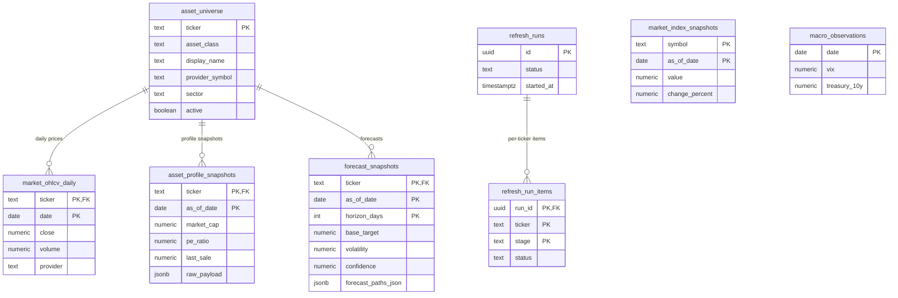
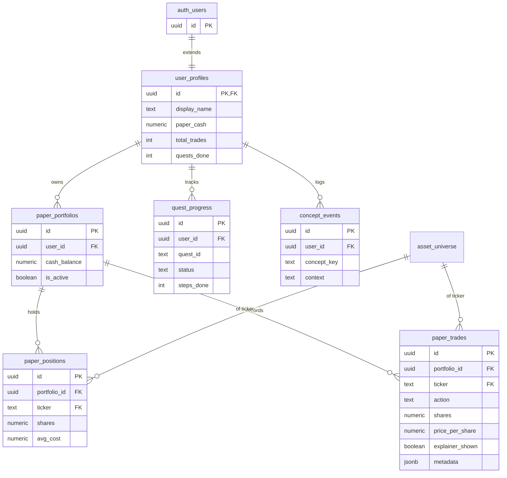

# Fiscally / ForesightLearn — Prototype, API & Data Documentation

> Companion doc to `README.md` and `PIVOT_PLAN.md`.
> Documents the **mobile prototype** (`fiscally-prototype.html`), the changes made to it,
> the **backend API** it talks to, the **database schema**, and an **ERD**.
>
> Last updated: 2026‑06‑04

---

## 1. Overview

**ForesightLearn** is a pivot of the *Foresight* market‑intelligence tool into **the go‑to learning app for money & investing**.

**North star:** the intersection of *learning* and the *numbers that back it*. It must avoid both failure modes that keep people out of investing — **walls of text** (fluff) and **overwhelming numbers** — and feel **welcoming, easy, and learning‑focused**.

> **Operating rule:** *Every number arrives with a sentence; every lesson arrives with a number — never a wall of either.*
> Achieved with **progressive disclosure** (plain verdict + picture first, dense numbers one tap deeper), **plain‑language anchors** on every metric, **friendly names** ("Bounciness" not "Annualized volatility"), and **Mia**, a character guide who translates numbers into meaning.

### Artifacts

| File | What it is |
|---|---|
| `fiscally-prototype.html` | **Active** mobile prototype — single‑file HTML, "Fiscally" purple/Mia design language. |
| `mobile-prototype.html` | Earlier green 5‑tab version (superseded, kept for reference). |
| `260602-Fiscally-Invest-screens.pdf` | Source design deck the prototype matches. |

Served locally via `.claude/launch.json` (`python3 -m http.server 3333`) → `http://localhost:3333/fiscally-prototype.html`.

---

## 2. Design Language

- **Palette** — dusty lavender matched to the deck: primary `#9084b4`, light `#c0b4d8`/`#a89ccc`, deep `#565072`; sage green `#4f9c7e`; brick `#cf5a40`; taupe secondary buttons `#a59c92`. Bottom‑nav active = green.
- **Mia** — hand‑drawn inline‑SVG avatar (peach skin `#f0b896`, brown hair `#43301f`). Delivers tips via **speech bubbles** + **"What's That?"** buttons that open a bottom‑sheet glossary.
- **Charts** — hand‑built inline SVG (no libraries): area/line, candlestick, donut, risk gauge, journey race‑track, and the **forecast fan chart**.
- **Forecast chart semantics** (matches Foresight) — solid green **historical** → dashed **base** (green) / **bull** (blue) / **bear** (red) with a shaded uncertainty cone and a "today" divider.
- **Font** — Plus Jakarta Sans.

---

## 3. Features (by screen)

Bottom nav (5 tabs): **Home · Learn · Trade · Tools · Social** (Trade is the emphasized center tab).

### 3.1 Onboarding (6 steps)
Experience quiz (Beginner/Intermediate/Experienced) → "Let's set some Goals!" → "Invest to Save" inputs → **How much to invest** (interactive donut + slider) → account type (TFSA, with Mia) → milestones summary → "Let's Start!". Skippable.

### 3.2 Home ("Let's Invest")
Mia greeting, **live portfolio hero** (mirrors the trade engine, tappable → Trade), goal‑progress card, and three menu cards (My Investment Journey, Scenarios, Tools).

### 3.3 Trade — *My Investment Journey* (paper trading)
Center nav tab. Style chip + portfolio chart + Cash / Unrealized / Realized stats, with sub‑tabs:
- **Holdings** — positions with per‑share avg cost & live unrealized P&L; accounts grouped (TFSA/RRSP) with Adjust → risk gauge.
- **Trade** — asset picker, Buy/Sell, shares, est. cost/proceeds, **pre‑trade explainer** (bear/base/bull from live price), execute. Weighted‑avg‑cost buys; realized‑P&L sells with a **Mia outcome sheet**.
- **Activity** — append‑only trade log, newest first.
- **Plan** — auto‑contribution amount + frequency, goal progress, milestones.

> The trade engine is a self‑contained JS model (`PF` state, `START_CAPITAL = 10000`). Not yet wired to the backend — the paper‑trading endpoints are **planned** (§6.2).

### 3.4 Tools
- **Stock Finder** (see §3.7) — search 56 assets, live forecast.
- **Market Today** — *live* indices (S&P, Nasdaq, Dow, TSX).
- **Scenario Forecast** — *live* bear/base/bull for a chosen ticker + Mia plain‑language read.
- **Compound Calculator** — interactive monthly‑contribution → 10/30‑yr projection.

### 3.5 Learn
Mia‑guided lessons (TFSA vs RRSP, compounding, risk), tappable glossary terms → bottom‑sheet, "concepts explored" counter.

### 3.6 Social
Level/XP ("Sprout 🌱"), weekly leaderboard, achievement badges (reframed quests), share, replay onboarding.

### 3.7 Stock Finder (learning‑first forecast page)
**Default view:** friendly horizon chips (3 months / 6 months / 1 year) · forecast **fan chart** (plain legend) · **Mia one‑sentence verdict** ("most likely around $X…") · scenario cards labelled **Rough case / Most likely / Strong case** · one plain teaching point (volatility as "bounciness").
**"See all the numbers ▾"** reveals the dense layer — each metric a row with value **and a plain sentence** (e.g. *"Worst drop −39% — …your money dipped about 39% before recovering"*), plus a company snapshot. Live from `POST /api/forecasts/ticker` + `GET /api/tickers/{ticker}/profile`, cached per `ticker_horizon`; loading + retry states.

### 3.8 Cross‑cutting
Mia bubbles, "What's That?" bottom‑sheet glossary, toast notifications, risk gauge (Adjust → Simulate/Invest), Scenarios "Mia's Journey" race‑track with a **Speed Up!** animation.

---

## 4. Change Log (this build)

1. **Created `fiscally-prototype.html`** — full redesign in the Fiscally language: onboarding, 4→5‑tab app, Mia, hand‑built SVG charts.
2. **Live data wiring** — Market Today + Scenario Forecast pull from the deployed backend with graceful mock fallback + Live/Sample badge.
3. **Brand match to the PDF deck** — extracted exact colors (stdlib PNG decoder), retuned palette + Mia (brown hair, peach skin).
4. **Paper‑trading flow** — *My Investment Journey* built out (Holdings/Trade/Activity/Plan, weighted‑avg cost, realized vs unrealized P&L, outcome sheet, contribution planning).
5. **Dedicated Trade tab** — promoted paper trading to a center nav tab (5 tabs); wired Home hero to the live engine; reconciled seed data to a clean `$10,000` start.
6. **Stock Finder** — searchable 56‑asset universe + live forecast **fan chart** + full Foresight‑style detail (scenario metrics, data confidence, company data, About).
7. **Learning‑first refactor** of Stock Finder — progressive disclosure + plain‑language anchors + friendly names (per the north star).

---

## 5. Architecture & Tech Stack

```
┌──────────────────────────┐     HTTPS / JSON      ┌─────────────────────────────┐     ┌──────────────────┐
│  Mobile prototype        │  ──────────────────▶  │  FastAPI backend (Render)   │ ──▶ │  Supabase         │
│  fiscally-prototype.html │   GET/POST /api/...    │  foresight-backend-*.onr... │     │  (Postgres + Auth)│
│  (single-file HTML+SVG)  │  ◀──────────────────  │  routes: market, forecasts, │     │                  │
└──────────────────────────┘   access-control-     │  portfolio, inference…      │     └──────────────────┘
                               allow-origin: *      └──────────────┬──────────────┘            ▲
                                                                   │  daily refresh pipeline   │
                                                                   ▼  (yfinance → OHLCV/idx)    │
                                                          provider data (yfinance, macro) ──────┘
```

- **Frontend (prototype):** self‑contained HTML/CSS/JS, inline‑SVG charts, no build step, no libraries.
- **Backend:** FastAPI; all routes under the **`/api`** prefix; deployed on Render (free tier → cold starts ~30–50 s). **CORS:** `access-control-allow-origin: *` (browser fetch works from any origin).
- **Data store:** Supabase Postgres. Market/forecast data populated by a **daily refresh pipeline** (tracked in `refresh_runs` / `refresh_run_items`). Auth via Supabase Auth (**planned** for paper trading).
- **Deployed API base:** `https://foresight-backend-a5qx.onrender.com`
  (frontend default lives in `frontend/api/endpoints.js`; local dev → `http://localhost:8000`).

---

## 6. API Endpoints

Base URL: `{API_BASE}` + `/api`. JSON request/response.

### 6.1 Implemented

| Method | Path | Purpose | Used by prototype |
|---|---|---|---|
| `GET` | `/api/health` | Service + data readiness | — |
| `GET` | `/api/models` | Available ML model artifacts | — |
| `GET` | `/api/universe` | All 56 assets grouped by class (ticker, display_name, history coverage) | (asset list mirrored client‑side) |
| `GET` | `/api/tickers/{ticker}/profile` | Company snapshot (bid/ask/last, mkt cap, P/E, 52‑wk, volume, yield, sector…) | ✅ Stock Finder |
| `GET` | `/api/market/indices` | Latest index snapshots (S&P, Nasdaq, Dow, TSX…) | ✅ Tools → Market Today |
| `GET` | `/api/market/indices/{symbol}/history?range=1y` | Index history series | — |
| `POST` | `/api/forecasts/ticker` | Bear/base/bull forecast for one ticker | ✅ Stock Finder, Scenario Forecast |
| `POST` | `/api/forecasts/market` | Market‑wide forecast | — |
| `POST` | `/api/inference` | RL/ML inference | — (deprecated direction) |
| `POST` | `/api/explanations` | Model explanations | — |
| `POST` | `/api/portfolio/simulations` | RL portfolio simulation | — (Simulator) |
| `GET` | `/api/data/refresh/status` | Data refresh pipeline status | — |
| `POST` | `/api/backtests` | Strategy backtest | — |

**`POST /api/forecasts/ticker`** — request `{ "ticker": "AAPL", "horizon_days": 90 }`; response includes
`latest_price`, `historical_prices[]`, `forecast_paths{bear,base,bull}[]`, `target_prices{bear,base,bull}`,
`returns{…}`, `risk_metrics{annualized_volatility, max_historical_drawdown, annualized_return, forecast_spread, regime_stability…}`,
`confidence` + `confidence_label`, `risk_label`, `opportunity_score`, `plain_language`, `literacy{bear_base_bull, volatility, drawdown, confidence}`, `forecast_change`, `data_quality`.

### 6.2 Planned (paper‑trading / learning layer — see `PIVOT_PLAN.md` §4)

All protected by Supabase JWT (`Authorization: Bearer <token>`); writes use service‑role key, reads enforce RLS.

| Method | Path | Purpose |
|---|---|---|
| `POST` | `/api/auth/profile` | Upsert `user_profiles` (idempotent, on login) |
| `GET` | `/api/auth/profile` | Profile + stats (total_trades, quests_done, concepts_seen) |
| `POST` | `/api/concepts/seen` | Log a `concept_events` row (fire‑and‑forget) |
| `GET` | `/api/paper/portfolio` | Cash + positions with live P&L |
| `POST` | `/api/paper/trades` | Execute a paper buy/sell |
| `GET` | `/api/paper/trades` | Paginated trade history |
| `GET` | `/api/paper/positions` | Open positions + unrealized P&L |
| `POST` | `/api/paper/portfolio/reset` | Reset cash to `$10,000` (keeps history) |
| `GET` | `/api/quests` | Quest definitions + user progress |
| `POST` | `/api/quests/{quest_id}/check` | Evaluate completion criteria |

---

## 7. Database Schema (Supabase / Postgres, schema `public`)

### 7.1 Implemented — market & forecast pipeline
Migrations: `202604240001_market_data.sql`, `202604250001_market_indices.sql`.

**`asset_universe`** — the 56 tradeable/forecastable assets.
`ticker (PK)`, `asset_class ∈ {stock,crypto,etf}`, `display_name`, `exchange`, `currency`, `sector`, `industry`, `country`, `provider_symbol`, `benchmark_group`, `min_history_days`, `active`, `created_at`, `updated_at` (trigger).

**`market_ohlcv_daily`** — daily prices. PK `(ticker, date)`; `ticker → asset_universe`.
`open`, `high`, `low`, `close (not null)`, `adjusted_close`, `volume`, `provider`, `ingested_at`.

**`asset_profile_snapshots`** — per‑day company/profile data. PK `(ticker, as_of_date)`; `ticker → asset_universe`.
`market_cap`, `pe_ratio`, `fifty_two_week_high/low`, `average_volume`, `volume`, `dividend_yield`, `dividend_frequency`, `ex_dividend_date`, `bid`, `ask`, `last_sale`, `day_open/high/low`, `exchange`, `margin_requirement`, `raw_payload (jsonb)`, `ingested_at`.

**`forecast_snapshots`** — stored bear/base/bull forecasts. PK `(ticker, as_of_date, horizon_days, window_size, method_version)`; `ticker → asset_universe`.
`latest_price`, `bear/base/bull_target`, `bear/base/bull_return`, `volatility`, `drawdown`, `confidence`, `confidence_label`, `forecast_paths_json (jsonb)`, `created_at`.

**`market_index_snapshots`** — index quotes. PK `(symbol, as_of_date)`.
`label`, `display_name`, `provider_symbol`, `value`, `previous_close`, `change`, `change_percent`, `day_open/high/low`, `volume`, `currency`, `provider`, `raw_payload`, `display_order`, `ingested_at`.

**`macro_observations`** — daily macro series. PK `date`.
`vix`, `federal_funds_rate`, `treasury_10y`, `unemployment_rate`, `cpi_all_items`, `recession_indicator`, `provider`, `ingested_at`.

**`refresh_runs`** — pipeline run header. PK `id (uuid)`. `provider`, `status ∈ {running,completed,partial,failed}`, `started_at`, `finished_at`, `requested_start/end_date`, `rows_inserted`, `rows_updated`, `error`, `metadata`.

**`refresh_run_items`** — per‑ticker/stage detail. PK `(run_id, ticker, stage)`; `run_id → refresh_runs`. `status ∈ {completed,failed,skipped}`, `rows_written`, `error`, `created_at`.

### 7.2 Planned — paper trading & learning
Migration (not yet created): `202606010001_paper_trading.sql`. **6 tables, all with Row‑Level Security** (`auth.uid()` ownership).

**`user_profiles`** — extends `auth.users`. PK `id (uuid) → auth.users(id)`. `display_name`, `paper_cash (default 10000)`, `total_trades`, `quests_done`, `created_at`, `updated_at`. RLS `auth.uid() = id`.

**`paper_portfolios`** — PK `id`; `user_id → user_profiles`. `name`, `cash_balance`, `is_active`, timestamps. RLS `user_id = auth.uid()`.

**`paper_positions`** — net holdings. PK `id`; unique `(portfolio_id, ticker)`; `portfolio_id → paper_portfolios`, `ticker → asset_universe`. `shares (≥0)`, `avg_cost`, `opened_at`, `updated_at`. Row deleted when shares = 0.

**`paper_trades`** — append‑only log. PK `id`; `portfolio_id → paper_portfolios`, `ticker → asset_universe`. `action ∈ {buy,sell}`, `shares (>0)`, `price_per_share`, `total_value`, `trade_date`, `note`, `quest_id`, `explainer_shown`, `metadata (jsonb)`, `created_at`.

**`quest_progress`** — PK `id`; unique `(user_id, quest_id)`; `user_id → user_profiles`. `quest_id`, `status ∈ {not_started,in_progress,completed}`, `steps_done`, `steps_total`, `started_at`, `completed_at`, `metadata`, timestamps. (Quest *definitions* live in a static backend dict.)

**`concept_events`** — glossary‑seen log. PK `id`; `user_id → user_profiles`. `concept_key`, `context`, `seen_at`. No unique constraint (dedup in count queries).

---

## 8. ERD

### 8.1 Market & forecast pipeline (implemented)


*(`market_index_snapshots` and `macro_observations` are standalone — no FK to `asset_universe`.)*

### 8.2 Paper trading & learning (planned)



---

## 9. Prototype ↔ backend mapping (live vs mocked)

| Prototype area | Status | Source |
|---|---|---|
| Tools → Market Today | **Live** | `GET /api/market/indices` |
| Tools → Scenario Forecast | **Live** | `POST /api/forecasts/ticker` |
| Stock Finder (chart, scenarios, metrics) | **Live** | `POST /api/forecasts/ticker` |
| Stock Finder (company data) | **Live** | `GET /api/tickers/{ticker}/profile` |
| Trade / Holdings / Activity / P&L | **Mocked** | self‑contained JS engine (`PF` state) |
| Scenarios / Mia's Journey | **Mocked** | client animation |
| Social (leaderboard, badges, level) | **Mocked** | static |
| Learn (glossary, lessons) | **Mocked** | static `GLOSS` map |
| Compound calculator | **Mocked** | client math |

> Mocked areas map to the **planned** auth/paper/quests endpoints (§6.2) and tables (§7.2). When those ship, the trade engine swaps from the in‑memory `PF` model to `/api/paper/*`.

---

## 10. Notes & gotchas

- **Cold starts:** the Render free tier sleeps; first request can take ~30–50 s. The prototype shows a Sample/loading state and retries.
- **Init order (prototype JS):** engine `var`s (`PF`, `SF_CACHE`, …) are assigned mid‑script, so render calls that use them must run at the **end** of the script, not on the early chart‑init line.
- **`dividend_yield`:** backend returns e.g. `0.35`; the older metrics view ×100's it to match Foresight's display (AAPL shows 35.00%). The learning‑first company snapshot omits it.
- **Forecast colors:** Stock Finder follows Foresight semantics (bull = blue, base = green, bear = red) rather than the Fiscally purple — easy to switch if brand consistency is preferred.
- **Next:** apply the learning‑first treatment to the Trade tab; tie Learn concepts to live portfolio numbers; optional global **Learn Mode** toggle.
